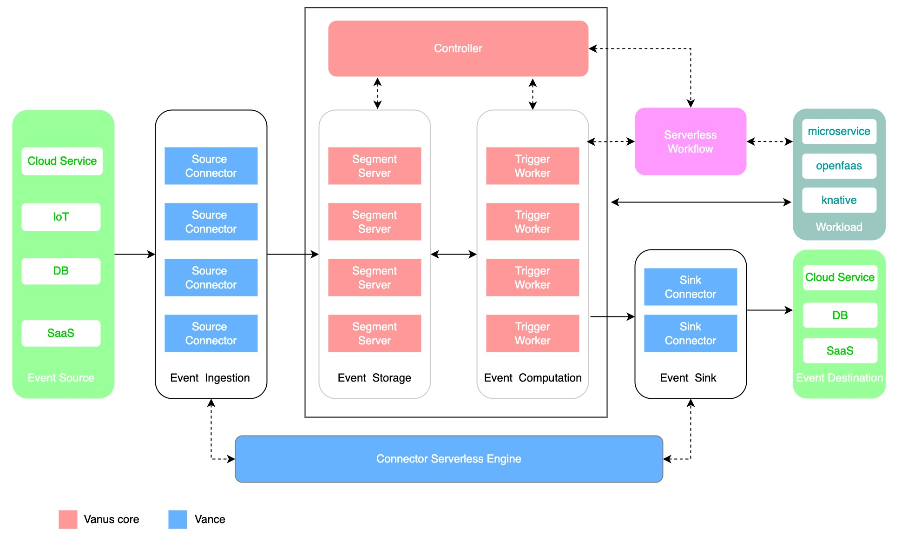

# Vanus

## What is Vanus

Vanus is a Serverless event platform for easily building Event-Driven Architecture (EDA) applications.
It provides enterprises and organizations an innovative platform for collecting, storing, distributing, and processing events at scale.

## Quick Start

See [quick-start](https://github.com/linkall-labs/docs/blob/main/vanus/quick-start.md)

## Community

[Join](https://join.slack.com/t/linkall-group/shared_invite/zt-1994ehs51-Yf5_EAvdfm4VH~o_djG7Sg) Slack Channel!

## How to contribute

See [here](CONTRIBUTING.md) for how to contribute to Vanus.

## Understanding Vanus

### Project Layout

This Project follows [golang-standards/project-layout](https://github.com/golang-standards/project-layout), see the
project for understanding well vanus' codebase.

### Architecture

## License

Vanus is under the Apache 2.0 license. See the [LICENSE](LICENSE) file for details.
